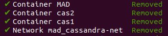
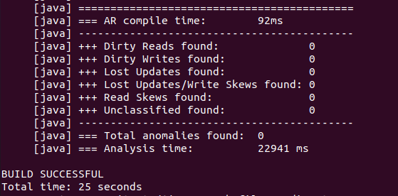
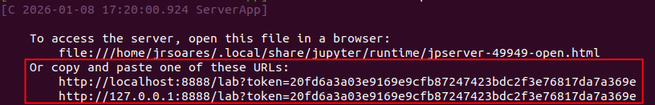
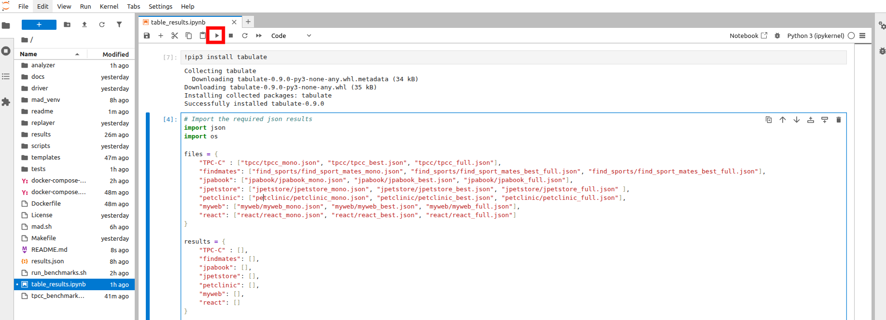
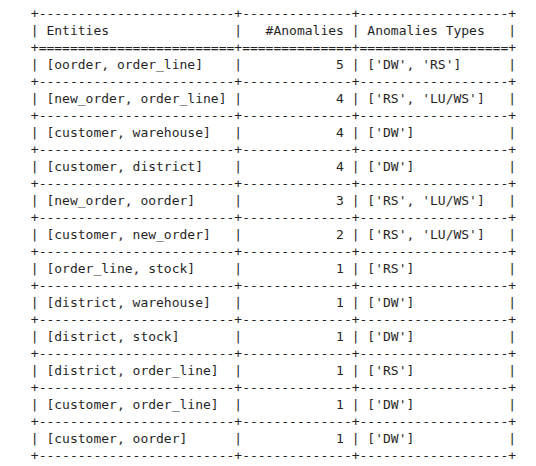
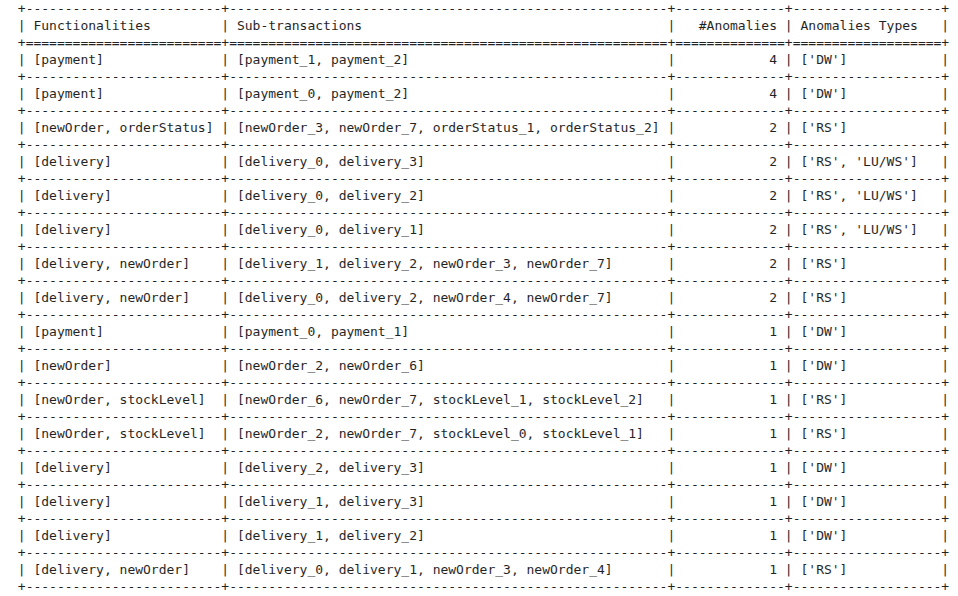
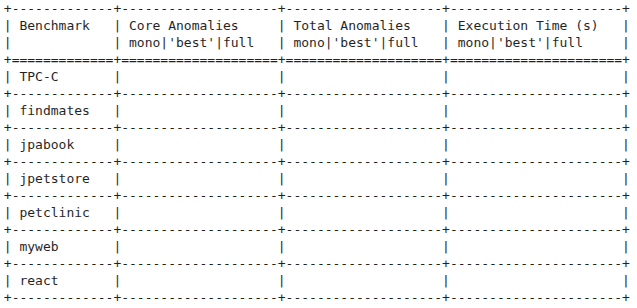
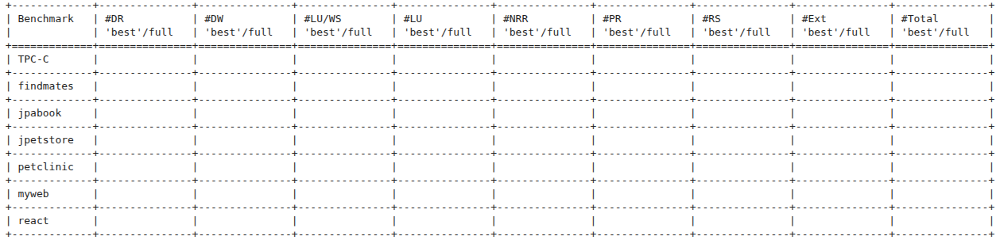
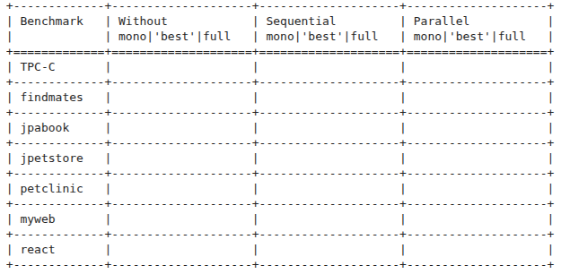

## Microservice Anomaly Detector: SMT-based Automatic Design-Time Detection of Anomalies in Migrations to Microservices
MAD (Microservice Anomaly Detector) is a testing framework for identifying anomalies that result from the decomposition of a monolith into microservices during design time.
Leveraging a static analyzer, it takes as input a (SQL) database-backed JAVA monolith application and a given decomposition and identifies possible data anomalies derived from the decomposition.
Furthermore, MAD classifies the anomalies according to definitions described in [Atya et al](https://ieeexplore.ieee.org/abstract/document/839388?casa_token=zuOCltn8xycAAAAA:vrespMjx6ygF-NPiUPWi2MyaOwlK_CUYzRWOnMXzDZvrb7XEUKdmhA8OG7lN-N1emW6_RaDD8Lk), providing developers a glimpse of the challenges that a given decomposition will entail. 

MAD's implementation is a fork of [CLOTHO](https://github.com/Kiarahmani/CLOTHO).
---

# Getting Started

Begin by cloning this repository, using the command:
``` 
git clone https://github.com/vdr07/MAD
```

We provide a docker image containing all required packages and environment settings. You may obtain the latest image version via docker:
``` 
docker pull jrafaelsoares:MAD\latest
```
Or by building the image yourself:
``` 
docker build -t MAD .
```

You may install and deploy MAD manually. 
We provide detailed instructions on manual installation and deployment [here](). 
For the rest of this guide, we assume the user is using our provided docker images.

## Dependencies

To deploy our prototype, we mainly depend on [Docker](https://www.docker.com/) and [Docker Compose]() to manage our containers.

You may find detailed guides on how to install Docker [here](https://docs.docker.com/engine/install/).
Furthermore, we require users to have access to docker without needing sudo. Details to achieve this can be found [here](https://docs.docker.com/engine/install/linux-postinstall/).
Note - This step requires the user to have root access to the machine.

### Docker Images

Our prototype requires two Docker images: one for our prototype and another to run a local [Cassandra](https://cassandra.apache.org/_/index.html) cluster.

We include both images in our repository, which you may install by running the commands:

``` 
docker load -i ./images/cassandra_docker_image.tar
docker load -i ./images/MAD.tar
```

You may also download the latest version of each image via DockerHub by running the command:
``` 
docker pull cassandra:latest
docker pull MAD:latest
```

## Deployment

Once you have installed all required dependencies and images, you can deploy our prototype.
We use [Docker Compose]() to manage our prototype's deployment. It deploys 3 containers:
- MAD, where the prototype will run;
- Two Cassandra Nodes;

To deploy our prototype, you can run the command:
``` 
docker compose up -d --build
```

If the deployment goes well, you should see a success message as so:


You can also see their running status by running the command:
``` 
docker ps
```

To which you should see a similar output to the image bellow, where STATUS of all docker containers is set to **Up**:


### Shutting down the deployment
If at any point you need to shutdown the deployment or restart the experiments, you may do so by running the command:
``` 
docker compose down
```

To which you should see a successful shutdown by observing a similar output:



## Test Run

To test if the installation was a success, connect to the MAD container by running the command:

``` 
docker exec -it MAD /bin/bash
```

This will connect your terminal to the docker container in the MAD directory. 
Before beginning the experiments, you must make sure that both Cassandra containers have finished their respective setups.
To do so, run the command:

``` 
./mad.sh --cluster
```

Both clusters are ready once both containers are observed in the `UN` state and the `Load` parameter in both containers is set to a value other than `?`.

Example of an unready / loading scenario (Note that the node representing DC1 is **UP** (via the state **UN** and **Load** different than **?**) while DC2 is still down (via the state **DN** and **Load** = **?**)


Example of a ready state / scenario, with both clusters showing the **UP** state:


### Build
To ensure the code has compiled correctly, run the command:
```
make benchmark=tpcc
```

It should return a **BUILD SUCCESSFUL** message like so:


### Test Run

Finally, we will test running MAD with a simple example.

Run the following command:
``` 
rm analyzer/src/benchmarks/tpcc/decomposition.json
cp analyzer/src/benchmarks/tpcc/mono_decomposition.json analyzer/src/benchmarks/tpcc/decomposition.json
./mad.sh --analyze tpcc | tee results/tpcc_mono
```

The test scenario should take around 25-30 seconds to run, and should return a `BUILD SUCCESSFUL` message, including the information about the AR compile time and anomaly detection:



# Step-by-Step

With the code successfully built, we begin the experiment execution.
We split the artifact evaluation in three steps, each resulting in different evaluation result and different execution times:
- TPC-C Analysis | 10-15 Minutes (Resulting in Table 6 and 7 of the paper);
- Complete Benchmark Analysis | 8 Hours (Resulting in Table 4 and 5 of the paper);
- Divide and Conquer Technique Evaluation | 20 Hours split across two 10 Hours sessions (Resulting in Table 8);

Time estimations are based upon the experimental evaluation setup on a virtual machine with 32 virtual CPU cores running on two
Intel(R) Xeon(R) Gold 5320 CPUs at 2.2GHz and 128GB of DDR4 RAM with Intel Optane Memory configured in App Mode.

While it is possible to deploy MAD on less powerful machines, do keep in mind this may result in increased execution times than the ones presented in our evaluation.
Nevertheless, the number and classification of detected anomalies will remain the same (unless MAD reaches the configurable limit analysis time of 4 hours for any given benchmark).

Given the long duration of each step, we include a shortened version of each step which excludes the `jpetstore` benchmark, which is responsible for the majority of execution time.
We advise the reviewer to first run the short version of each step, as it accounts for the majority of the evaluation.

## Step 1 - TPC-C Analysis

In this step, we use MAD to analyze the TPC-C benchmark. We use this analysis to recreate Tables 6 and 7 of the paper.

Inside the MAD directory, run the command:
``` 
./tpcc_benchmarks.sh
```

### Result Processing
If successful, the command will result in three `json` files being created in the directory `results/json/dc/tpcc`.

To visualize the results, we use a Jupyter Notebook already installed in the Docker container.
Inside the container, run the command:

```
jupyter notebook --ip=0.0.0.0 --no-browser --allow-root
```

The command should output a result as seen bellow, including a URL to access the Notebook:



Copy one of the two presented URL's into a local browser, which will open the Jupyter Notebook. Inside the Notebook, select the `table_results.ipynb` file.
You should see the Notebook as seen bellow:



You can now run each step by clicking the `Step` icon highlighted above (or via `Shift+Enter` in the keyboard).
If done correctly, the reviewer should observe the two following tables:

### Table 6



### Table 7



**WARNING -** Stop the jupyter notebook before continuing the evaluation, as it will affect the results. 
One can stop the notebook by simply interrupting via `Ctrl + C`.

## Step 2 - Complete Benchmark Analysis 

In this step, we use MAD to analyze all other Benchmarks. We use this analysis to recreate Tables 4 and 5.

As previously mentioned, the analysis of one benchmark in particular (`jpetstore`) comprises the majority of analysis time.
As such, we split this step into two substeps:

- A shorter step (90min), analyzing all benchmarks except `jpetstore`, via the command: `./short_benchmarks.sh` 
- `jpetstore` Analysis (5h), solely analysing `jpetstore`, via the command: `./jpetstore_benchmark.sh`

### Result Processing

To visualize the results (which may be done even without the `jpetstore` analysis), deploy once again the Jupyter Notebook and connect via the browser, as in the previous step.

Continuing the execution of the Jupyter Notebook up until steps 8 and 9, the reviewer may now observe two additional tables filled as seen bellow:

### Table 4



### Table 5



## Step 3 - Divide and Conquer Technique Evaluation

In this step, we evaluate the performance benefits of MAD's divide and Conquer Technique by comparing its performance with variations of the search algorithm:
- Without Divide and Conquer;
- Sequential Divide and Conquer;

Each version is located in a separate directory inside the container.

**NOTE** - Since the reviewer is likely to deploy MAD on different hardware, it is to be expected that the obtained results diverge from the absolute values depicted in the paper.
Nevertheless, the reviewer can observe the advantages of the Divide and Conquer Technique by specially comparing the execution times of the `TPC-C` and `jpabook` benchmarks.
Thus, we suggest the reviewer first runs both short versions of each step to observe these results, as they take significantly shorter time than the longer versions.


### Without Divide and Conquer

For this version, change your directory inside the container by running the command:
``` 
cd /WithoutDC
```

Similarly to Step 2, we split the execution into two substeps:
- A shorter step (3h), analyzing all benchmarks except `jpetstore` and `react`, via the command: `./short_benchmarks.sh`
- `jpetstore` and `react` Analysis (16h), analyzing both `jpetstore` and `react` which both include multiple decompositions that eventually timeout after 4h, via the command: `./long_benchmarks.sh`

### Sequential Divide and Conquer

For this version, change your directory inside the container by running the command:
``` 
cd /Sequential
```
Similarly, we split the execution into two substeps:
- A shorter step (90min), analyzing all benchmarks except `jpetstore`, via the command: `./short_benchmarks.sh`
- `jpetstore` Analysis (5h), solely analysing `jpetstore`, via the command: `./long_benchmarks.sh`

### Result Processing

Once both steps have been executed, the reviewer may compile the results back into the `MAD` directory by running the command:

``` 
rsync -av /Sequential/results/json /MAD/results
rsync -av /WithoutDC/results/json /MAD/results
```

Once compiled, the reviewer may visualize the results by once again starting the Jupyter Notebook as depicted in previous steps.
Finally, run the additional steps in the Junyter Notebook and it will present Table 8 as pictured below.

### Table 8



---
Copyright (c) 2019 Kia Rahmani, Rafael Soares