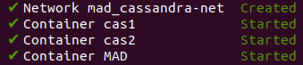
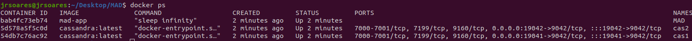
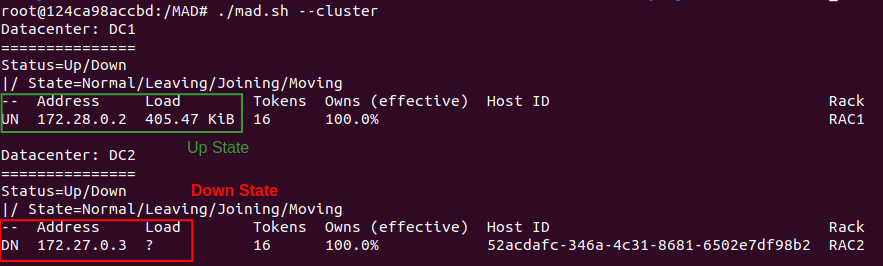
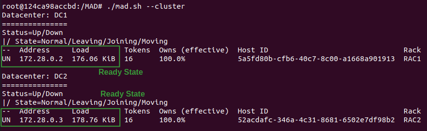
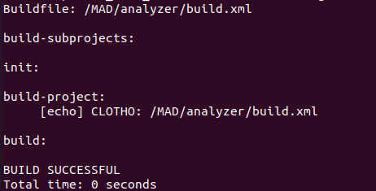

## Microservice Anomaly Detector: SMT-based Automatic Design-Time Detection of Anomalies in Migrations to Microservices
MAD (Microservice Anomaly Detector) is a testing framework for identifying anomalies that result from the decomposition of a monolith into microservices during design time.
Leveraging a static analyzer, it takes as input a (SQL) database-backed JAVA monolith application and a given decomposition and identifies possible data anomalies derived from the decomposition.
Furthermore, MAD classifies the anomalies according to definitions described in [Atya et al](https://ieeexplore.ieee.org/abstract/document/839388?casa_token=zuOCltn8xycAAAAA:vrespMjx6ygF-NPiUPWi2MyaOwlK_CUYzRWOnMXzDZvrb7XEUKdmhA8OG7lN-N1emW6_RaDD8Lk), providing developers a glimpse of the challenges that a given decomposition will entail. 

MAD's implementation is a fork of [CLOTHO](https://github.com/Kiarahmani/CLOTHO).
---

# Getting Started

Begin by cloning this repository, using the command:
``` 
git clone https://github.com/vdr07/MAD
```

We provide a docker image containing all required packages and environment settings. You may obtain the latest image version via docker:
``` 
docker pull jrafaelsoares:MAD\latest
```
Or by building the image yourself:
``` 
docker build -t MAD .
```

You may install and deploy MAD manually. 
We provide detailed instructions on manual installation and deployment [here](). 
For the rest of this guide, we assume the user is using our provided docker images.

## Dependencies

To deploy our prototype, we mainly depend on [Docker](https://www.docker.com/) and [Docker Compose]() to manage our containers.

You may find detailed guides on how to install Docker [here](https://docs.docker.com/engine/install/).
Furthermore, we require users to have access to docker without needing sudo. Details to achieve this can be found [here](https://docs.docker.com/engine/install/linux-postinstall/).
Note - This step requires the user to have root access to the machine.

### Docker Images

Our prototype requires two Docker images: one for our prototype and another to run a local [Cassandra](https://cassandra.apache.org/_/index.html) cluster.

We include both images in our repository, which you may install by running the commands:

``` 
docker load -i ./images/cassandra_docker_image.tar
docker load -i ./images/MAD.tar
```

You may also download the latest version of each image via DockerHub by running the command:
``` 
docker pull cassandra:latest
docker pull MAD:latest
```

## Deployment

Once you have installed all required dependencies and images, you can deploy our prototype.
We use [Docker Compose]() to manage our prototype's deployment. It deploys 3 containers:
- MAD, where the prototype will run;
- Two Cassandra Nodes;

To deploy our prototype, you can run the command:
``` 
docker compose up -d --build
```

If the deployment goes well, you should see a success message as so:



You can also see their running status by running the command:
``` 
docker ps
```

To which you should see a similar output to the image bellow, where STATUS of all docker containers is set to **Up**:


### Shutting down the deployment
If at any point you need to shutdown the deployment or restart the experiments, you may do so by running the command:
``` 
docker compose down
```

To which you should see a successful shutdown by observing a similar output:


## Test Run

To test if the installation was a success, connect to the MAD container by running the command:

``` 
docker exec -it MAD /bin/bash
```

This will connect your terminal to the docker container in the MAD directory. 
Before beginning the experiments, you must make sure that both Cassandra containers have finished their respective setups.
To do so, run the command:

``` 
./mad.sh --cluster
```

Both clusters are ready once both containers are observed in the `UN` state and the `Load` parameter in both containers is set to a value other than `?`.

Example of an unready / loading scenario (Note that the node representing DC1 is **UP** (via the state **UN** and **Load** different than **?**) while DC2 is still down (via the state **DN** and **Load** = **?**)



Example of a ready state / scenario, with both clusters showing the **UP** state:



### Build
To ensure the code has compiled correctly, run the command:
```
make benchmark=tpcc
```

It should return a **BUILD SUCCESSFUL** message like so:



### Test Run

Finally, we will test running MAD with a simple example.

Run the following command:
``` 
rm analyzer/src/benchmarks/tpcc/decomposition.json
cp analyzer/src/benchmarks/tpcc/mono_decomposition.json analyzer/src/benchmarks/tpcc/decomposition.json
./mad.sh --analyze tpcc | tee results/tpcc_mono
```

## Manual Installation

We include an automatic dependency installation script in `install_dependencies.sh`. 
MAD has three key dependencies:

- [Java 1.8.0](https://java.com/en/download/help/index_installing.xml)
- [Z3 Theorem Prover](https://github.com/Z3Prover/z3) (Our protype used version 4.11.2)
- [Docker](https://www.docker.com/)
- [Maven]()


---

### Result Reproducibility

MAD follows the same running instruction as of CLOTHO, which can be found in detail [here](https://github.com/Kiarahmani/CLOTHO/blob/master/README.md).
For reproducibility, we provide `run_benchmark.sh`, which analyses the seven benchmarks and respective decomponsotions evaluated in the paper.

---
Copyright (c) 2019 Kia Rahmani, Rafael Soares